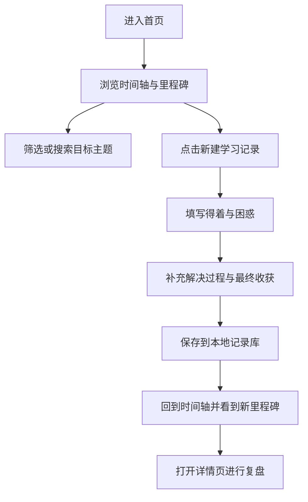

## 1. 产品概述
这是一个面向日语学习者的个人成长记录网页，用于沉淀每次学习中的得着、困惑、解决路径与阶段性里程碑。
- 产品核心目标是把零散的学习笔记整理成可回顾、可追踪、可形成方法论的成长轨迹，帮助用户持续复盘与建立成就感。
- 产品价值在于把“学到了什么”“卡在了哪里”“如何解决”“最终收获了什么”串成完整闭环，降低遗忘率并强化长期学习动机。

## 2. 核心功能

### 2.1 功能模块
1. **首页 / 学习时间轴**：站点介绍、最近得着、里程碑概览、时间轴浏览、筛选与搜索。
2. **记录创建页**：新增学习记录，录入得着、困惑、解决过程、标签、日期与里程碑等级。
3. **记录详情页**：查看单条记录的完整学习闭环、关联标签、前后记录跳转与再次反思。

### 2.2 页面详情
| 页面名称 | 模块名称 | 功能说明 |
|-----------|-------------|---------------------|
| 首页 / 学习时间轴 | 顶部引导区 | 展示站点定位、学习宣言、快速新建按钮、统计概览 |
| 首页 / 学习时间轴 | 里程碑摘要区 | 以卡片形式展示阶段成果，如“第一次听懂完整句子”“攻克助词对比” |
| 首页 / 学习时间轴 | 时间轴列表 | 按时间顺序展示学习记录，每条包含得着、困惑、解决状态、标签和日期 |
| 首页 / 学习时间轴 | 筛选与搜索 | 按标签、是否已解决、里程碑等级筛选，支持关键词搜索 |
| 记录创建页 | 记录表单 | 输入标题、学习日期、得着、困惑、解决过程、最终收获、标签、里程碑等级 |
| 记录创建页 | 草稿预览 | 实时预览记录卡片样式，降低录入成本 |
| 记录详情页 | 闭环内容区 | 分段展示“得着 / 困惑 / 解决过程 / 最终得着” |
| 记录详情页 | 关联上下文 | 展示关联标签、前后记录跳转、相似主题推荐 |

## 3. 核心流程
用户进入首页后先看到自己的日语学习成长轨迹与最近里程碑，随后可以浏览历史记录、筛选某类困惑或某个知识主题；当用户新增一条学习记录时，需要依次填写得着、困惑、解决过程和最终收获，系统将其保存并加入时间轴；用户可再次打开详情页复盘某条记录，借助前后关联内容看到自己是如何一步步跨越卡点的。

## 4. 用户界面设计
### 4.1 设计风格
- 整体方向：桌面优先的“学习档案馆 + 文学感时间轴”，营造沉浸、克制、带一点纸本文献感的日语学习氛围。
- 主色：墨蓝黑、米白纸色、雾金色点缀。
- 辅色：抹茶绿、朱砂红，用于标记“已突破”和“仍困惑”的状态差异。
- 按钮样式：圆角较小的半透明实体按钮，强调压感与轻微浮层阴影。
- 字体建议：标题使用具有编辑感的衬线字体，正文使用高可读的人文字体，数字与标签使用等宽或半等宽字体增强档案感。
- 布局风格：非完全对称布局，结合纵向时间轴、层叠卡片、侧边信息栏。
- 图标风格：极简线性图标，搭配少量日语学习相关符号与状态徽记。

### 4.2 页面设计概览
| 页面名称 | 模块名称 | UI 元素 |
|-----------|-------------|-------------|
| 首页 / 学习时间轴 | 顶部引导区 | 大标题、学习宣言、副标题、主操作按钮、纸张纹理背景、渐显动画 |
| 首页 / 学习时间轴 | 里程碑摘要区 | 高对比卡片、阶段编号、关键突破词、微动效边框 |
| 首页 / 学习时间轴 | 时间轴列表 | 左侧时间线、右侧内容卡、状态徽章、标签胶囊、悬停展开 |
| 首页 / 学习时间轴 | 筛选与搜索 | 吸附式控制栏、筛选芯片、搜索框、切换动画 |
| 记录创建页 | 记录表单 | 分区输入框、里程碑等级选择、标签输入、局部高亮边框 |
| 记录创建页 | 草稿预览 | 与正式卡片一致的预览组件、字段缺失提示 |
| 记录详情页 | 闭环内容区 | 多段内容版式、引导线、强调引用框、前后文导航 |

### 4.3 响应式
- 采用桌面优先设计，在大屏下突出时间轴叙事与左右分栏。
- 平板与移动端保持完整功能，时间轴改为单列堆叠，筛选栏改为横向滚动。
- 触控场景下增大按钮热区并简化悬停依赖，保证录入体验。
