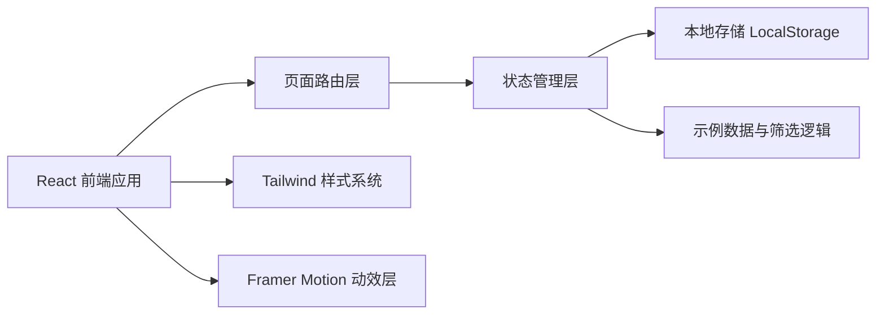
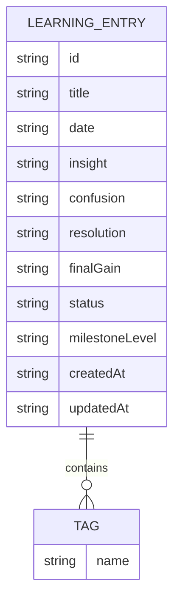

## 1. 架构设计


## 2. 技术描述
- 前端：React 18 + TypeScript + Vite
- 样式：Tailwind CSS 3，配合 CSS 变量构建主题色、纹理与层次效果
- 动效：Framer Motion，用于时间轴入场、卡片悬停、里程碑切换等动效
- 路由：React Router，用于首页、创建页、详情页导航
- 数据：LocalStorage 持久化存储；初始内置 mock 数据，便于首屏展示
- 后端：无
- 初始化工具：Vite

## 3. 路由定义
| 路由 | 用途 |
|-------|---------|
| / | 首页与学习时间轴 |
| /new | 新建学习记录页 |
| /entry/:id | 学习记录详情页 |

## 4. API 定义
本项目不引入独立后端 API，前端通过统一的数据访问层封装本地存储操作。

### 4.1 TypeScript 数据类型
```ts
type EntryStatus = "resolved" | "ongoing";

type MilestoneLevel = "spark" | "step" | "breakthrough" | "mastery";

interface LearningEntry {
  id: string;
  title: string;
  date: string;
  insight: string;
  confusion: string;
  resolution: string;
  finalGain: string;
  tags: string[];
  status: EntryStatus;
  milestoneLevel: MilestoneLevel;
  createdAt: string;
  updatedAt: string;
}
```

### 4.2 本地数据访问接口
```ts
interface EntryRepository {
  list(): LearningEntry[];
  getById(id: string): LearningEntry | null;
  create(entry: LearningEntry): void;
  update(entry: LearningEntry): void;
  delete(id: string): void;
}
```

## 5. 数据模型
### 5.1 数据模型定义


### 5.2 数据定义说明
- `LearningEntry` 是唯一核心实体，围绕一条完整的学习闭环展开。
- `tags` 用于标记语法主题、词汇主题、听力、口语、阅读等维度。
- `status` 区分“仍在困惑中”与“已经解决”，支持时间轴快速扫描。
- `milestoneLevel` 用于表达得着的重要程度，支撑首页里程碑摘要展示。

## 6. 前端模块拆分
- `pages/HomePage`：整合首页头图、统计、筛选栏、时间轴与里程碑摘要。
- `pages/NewEntryPage`：负责录入表单、预览区、保存逻辑与校验反馈。
- `pages/EntryDetailPage`：负责展示单条记录详情与关联导航。
- `components/TimelineCard`：渲染时间轴单条记录。
- `components/MilestonePanel`：渲染高亮里程碑与阶段成就。
- `components/EntryForm`：封装输入逻辑、标签处理和字段校验。
- `lib/storage`：封装 LocalStorage 读写。
- `lib/mockData`：提供初始样例数据。

## 7. 实施要点
- 采用桌面优先布局，确保首页具有明显的纵向叙事感和档案馆气质。
- 通过少量高质量动效增强“突破卡点”的仪式感，而不是使用噪声式动画。
- 保持无后端依赖，确保可以直接构建并交付静态生产产物。
- 首屏必须有高质量示例内容，避免空页面影响产品感知。
